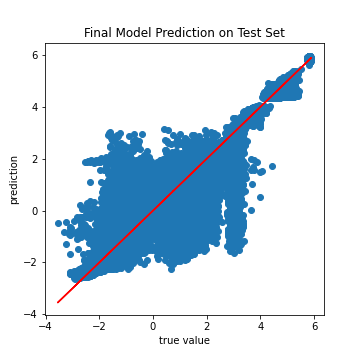

# Molecular_Properties_Prediction
Data sourced from Kaggle Competition: [Predicting Molecular Properties](https://www.kaggle.com/c/champs-scalar-coupling/data)

**Author**:
- [Hyunwook Paul Shin](https://github.com/hps1795)


## Overview
This notebook contains the steps of solving the molecular properties prediction involving the molecular structural data. The project aims to create a model that can accurately predict the target variable, the scalar coupling constant. Since this is a prediction on the continuous quantity output, the problem is defined as the regression problem. Then, the metrics are set as R-squared score, root mean squared error, and mean absolute error to evaluate the regression model: goal is to enhance the R2 score while maintaining the low error values. After performing multiple modeling, the Keras Neural Network is selected as the best model. 

***

## Business Problem
Nuclear Magnetic Resonance (NMR) is a core technique used to understand the structure and interactions of molecules and proteins. NMR is being utilized by researchers in the pharmaceutical and chemical fields worldwide. The NMR performance is largely dependent on the accurate prediction of the variable, scalar coupling constant (SCC). 

SCC is a magnetic interaction (also called 'coupling') between two atoms. It is the feature that provides information on the connectivity of chemical structure, which is used to explain the interaction between the molecules in NMR. However, the constraint in SCC calculation limits the application of this technique; the calculation length takes from days to even weeks for one molecule when the structural information of the molecule is an input, and the cost of calculation is expensive.

Therefore, creating a model that can accurately predict the SCC will allow the NMR to be applicable for research in a daily basis. The model will enable pharmaceutical researchers to gain insight on how the molecular structure affects the properties and behavior faster and cheaper and accelerate the innovation in inventing and designing new drugs.

***

## Data Understanding
**Data sourced from Kaggle Competition: [Predicting Molecular Properties](https://www.kaggle.com/c/champs-scalar-coupling/data)**

Two dataset we will be using are:

- train.csv
    - the training set, where the first column (molecule_name) is the name of the molecule where the coupling constant originates (the corresponding XYZ file is located at ./structures/.xyz), the second (atom_index_0) and third column (atom_index_1) is the atom indices of the atom-pair creating the coupling and the fourth column (scalar_coupling_constant) is the scalar coupling constant that we want to be able to predict

- structures.csv 
    - this file contains the same information as the individual xyz structure files, but in a single file

Distribution of the target variable is displayed below:

The distribution is right skewed, which means the target variable needs to be normalized.

After Cubic Rooted Transformation, the target variable is more normalized as shown below.


***

## Data Preparation 
For data preparation, the following tasks were done:
- Merge train_df and structures_df
- Create new features, such as distance and angle of the bond
- Normalize the target variable
- Check the multicollinearity of each column
- Split the dataset into train, test, and validation set
- Perform preprocessing

For Normalization, cubic root transformation was used. Logistic transformation and square root transformation are also good options in handling the skewed distribution. However, since the logarithm and the square root are only defined for positive numbers, you can't take the logarithm of negative values. This means logistic transformation cannot be applied to our target variable, which contains negative values.

The rule of thumb for multicollinearity is that severe multicollinearity may be present if the correlation coefficient is higher than 0.8. None of the features had a coefficient higher than 0.8, and, therefore, it was concluded that the dataset does not have severe multicollinearity. Multicollinearity was found by using the heatmap shown below. 


For the preprocessing, the columns are divided into two different columns: numerical and categorical. Numerical columns are scaled with MinMaxScaler, while categorical columns are encoded using LabelEncoder.

***

## Modeling Result

The final model is a Keras Sequential Model. The report of the results on holdout test set is displayed below.




- R2 Score: 0.9461544983983261
- RMSE: 0.45984758219441946
- MAE: 0.26220035989513957
- Prediction time: 89.96339583396912s for 931816 predictions

***

## Conclusions
Based on the results on the test set:

- The R2 score on the test set is 0.946. This means the predicted target variable on the test set shows a high positive correlation with the actual test target variable. Also, the R2 score of 0.946 means approximately 94.6% of the observed variation can be explained by the final Keras model.


- RMSE of 0.460 and MAE of 0.262 are both low values. This means the final model can predict the target variable accurately.


- Metrics for the test set are very close to those of the train and validation set. This means the final model is generalized and available to apply to the real-world coupling constant prediction without bias.


When necessary pieces of information (features in train_df2) are provided, the final model can give an accurate prediction on the target variable in less than a second for each combination of the atom inside the molecule: It took about 90 seconds for more than 90k predictions on the test set. This will significantly reduce the cost and time it takes to predict the scalar coupling constant, which takes days to even weeks for one molecule when the traditional calculation method is used. Therefore, I strongly recommend researchers apply this model to their NMR research process to speed up their research process.


***

## Next Steps

- **Data Collection and Feature Engineering:** Additional feature engineering can enhance the model prediction accuracy even better. Features like the type of hybridization, which is the new hybrid created by mixing different atoms, affect the structure and the properties of the molecule, which is a valuable factor for explaining the property of the molecules. Also, gathering even more data can create a more generalizable and accurate model. Therefore, more data scrapping on different molecules is recommended.


- **Divide into Subset**: The analysis and prediction are made on the whole train_df in this project: overall performance does not explain how the model works on each type of couplings. Therefore, dividing the data into a subset based on eight different coupling types will allow us to fine-tune the model specifically targeting one coupling type. Also, models we previously used might perform better on one type while showing worse performance on other types. By dividing the dataset and modeling them, we can build further insight into which model and hyperparameters work best for each type of couplings and enhance the prediction accuracy.

***

## Setup Instructions

#### Module versions
Information of the modules used and their versions to recreate this project:

- jupyter: 1.0.0
- Python: 3.8.5
- numpy: 1.21.4
- pandas: 1.1.3
- seaborn: 0.11.0
- matplotlib: 3.3.1
- scikit-learn: 0.23.2 
- xgboost: 1.2.1
- lightgbm: 3.3.1
- catboost: 1.0.3
- tensorflow: 2.3.1
- keras: 2.4.3

#### Dataset Download
The dataset for the project is over 100MB, so it cannot be uploaded to GitHub. For the dataset, proceed to the following link: https://www.kaggle.com/c/champs-scalar-coupling/data. One who wants to download the dataset needs to sign up for the competition. After agreeing on the acknowledgment, one will be able to download the dataset files. You can choose to download the files you desire to use only or simply just download them all. When you click to download all, you will be downloading the zip file, **champs-scalar-coupling.zip**. Unzip the files and move data into the Data/ directory of this repository.

***

## Repository Structure

```
├── Data                                <- Empty Data Folder (Read Information section for the guide to download the dataset) 
├── Final_Model                         <- Folder containing the saved Final Model
│   └── ...
├── Images                              <- Folder containing graphs and images from notebooks and presentation
│   └── ...
├── .gitignore                          <- Data file was large and ignored
├── Final Notebook.ipynb                <- Narrative documentation of project in Jupyter notebook
├── README.md                           <- Abstract Summary of the Final Notebook 
└── presentation.pdf                    <- PDF version of project presentation
``` 
